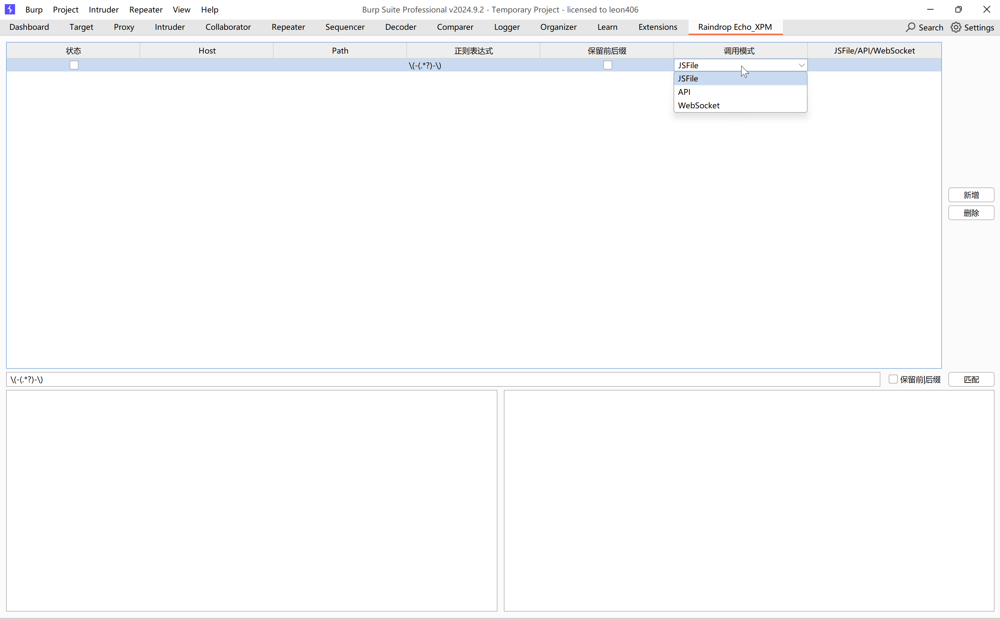
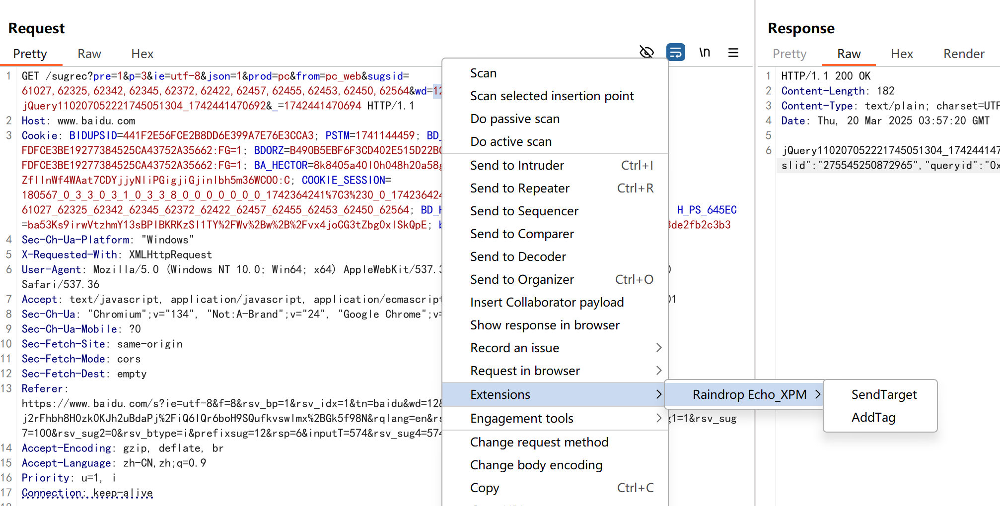
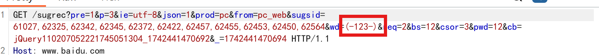
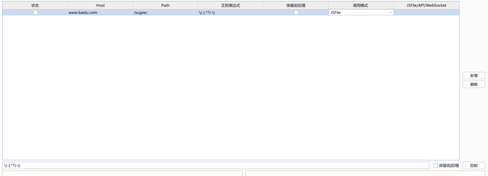
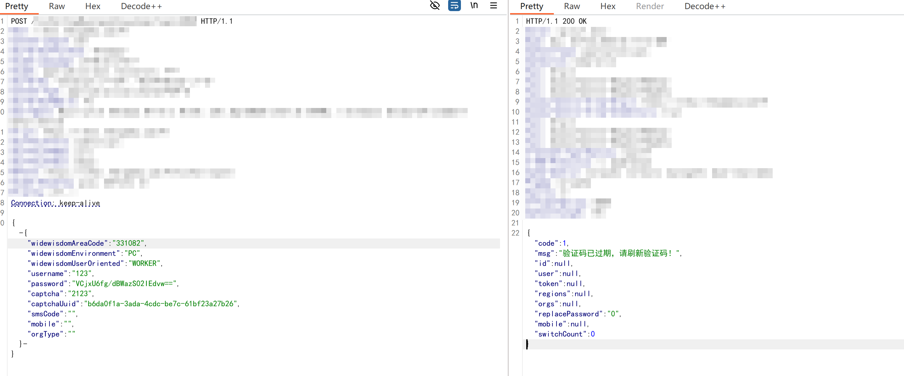
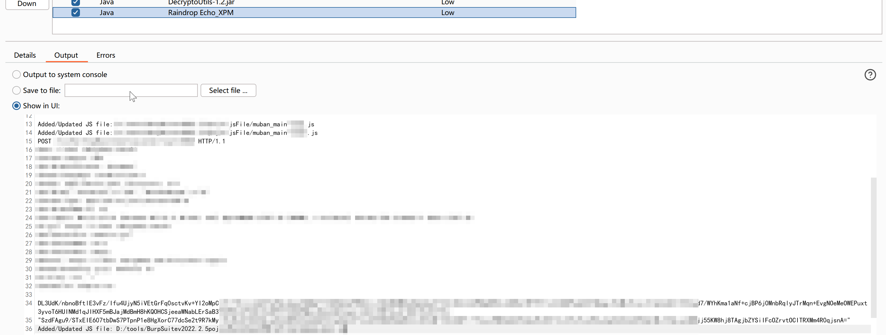
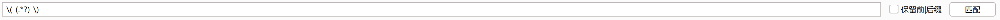
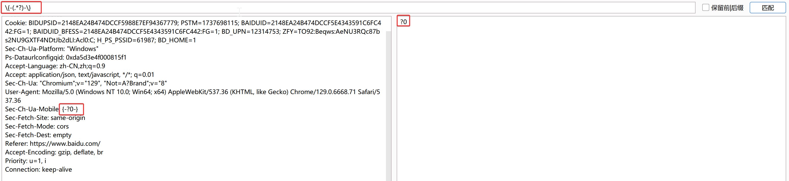
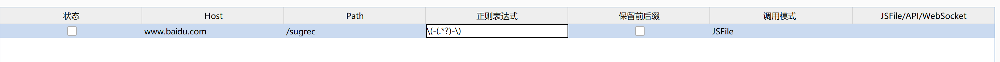

# 写在前面
该工具为原git项目RaindropEcho的JAVA重构，有一些功能增删，更适合日常使用。原作者:tingyusys，项目地址:[RaindropEcho](https://github.com/tingyusys/RaindropEcho)。

工具特点：

1. 可实现**请求、响应的自动加解密**，适用于**Repeater、Intruder下的接口测试**；
2. 自定义正则匹配逻辑。对请求头/体中匹配到的内容进行处理；
3. **自定义加解密JS，适用于能直接扣JS的情况**：简单的加解密方法可直接复制前端源码，复杂情况需要做逆向；已提供Webpack的逆向模板；
4. **特定字段的生成/改造**。
5. **支持WebSocket调用接口**，提供一种简化的JS RPC方法。
6. **新增聚合处理功能**，可将多个标记点的数据聚合后进行处理，适用于一些有数据签名的场景。
7. ~~**更懒人的情况**，思路：node.js集成Cyberchef模块，搭建方案参考jsfiles/cyberchef-env/。使用：将网页端的Cyberchef调好方法把recipe复制到main_cyberchef.js的对应配置处，用JS或者API模式调用即可，甚至可以一点代码不写。~~


使用逻辑一：

1. 跟踪到前端加解密函数后，扣出对应JS到muban_main.js(muban_ende.js)中调用调试。

   调试方法：

   ​	node muban_main.js [encrypt_c|decrypt_c] [input]

   ​	node muban_main.js [encrypt|decrypt] [inputfile] [outputfile]

2. 右键发送数据包到插件，插件页面配置接口地址，提取正则等基本信息。

3. 选择加解密调用模式，并配置：
   1. JSFile：muban_main.js地址
   2. API：执行node muban_main.js server 8888，配置地址，例：http://127.0.0.1:8888/

4. 勾选状态启用后，Repeater、Intruder中打好标签（默认为"(-xxxx-)"，和正则一致）发包时便开始调用方法；或者不打标签，选择要加、解密的数据后使用右键功能，右键功能可在Proxy下使用。

5. 处理数据在插件日志中有记录。


使用逻辑二：

1. 控制台定位到加解密对应的调用函数，打好断点
2. 右键发送数据包到插件，插件页面配置接口地址，提取正则等基本信息。
3. 选择调用模式：WebSocket--配置地址：ws://127.0.0.1:12080/，将JS注入到浏览器环境后（下文已提供），并在WsClient中完成加解密方法调用。


使用逻辑三：

1. 在node中集成Cyberchef，搭建方案参考jsfiles/cyberchef-env/，

2. 在Cyberchef html上调整好要做的加解密逻辑，复制recipe(JSON)到main_cyberchef.js对应配置处，并完成调试。

3. 右键发送数据包到插件，插件页面配置接口地址，提取正则等基本信息。

4. 选择加解密调用模式，并配置：

   JSFile：muban_main.js地址

   1. API：执行node muban_main.js server 8888，配置地址，例：http://127.0.0.1:8888/

5. 勾选状态启用配置。



## 功能支持的更新

* [x] 提供 JS 逆向模版，支持自定义编写：指定域名下指定接口的加解密算法
* [x] 支持导入多个模版，同时破解多个接口的加密算法
* [x] 导入模板后，将数据包送到插件里，RaindropEcho 会自动解密，并将解密的数据包放入到重放器
* [x] 修改完数据后，发送数据包，RaindropEcho 会自动拦截明文数据包，进行加密后发出
* [x] 支持响应数据包解密，支持Repeater、Intruder自动加、解密
* [x] 扩大接口匹配范围，匹配子目录下所有接口
* [x] Java重构，使用新的Montoya API(2024.12)；使用正则匹配请求包中要加密的字段，支持url、header、body中多个字段的同时加密
* [x] UI更新;新增正则功能，可修改默认表达式;新增右键标记功能
* [x] 支持http接口，可通过muban_main.js启动服务
* [x] 支持WebSocket接口，提供hook方式，可实现JS RPC调用
* [x] 新增聚合处理功能，可将多个标记点的数据聚合后进行处理
* [x] ~~提供一个node中集成Cyberchef的搭建和使用方案~~


# 环境需求

```
开发使用环境:

    Burpsuite2024.9.2;
```


          JDK 17;


          nodejs v22.12.0;


      建议使用较新版本burp，已知2022版本无法加载,jdk1.8无法加载。


# 工具使用


## JS 逆向模版 \*\*重要\*\*

- 在 encryptFunction 函数里写好加密逻辑
- 在 decryptFunction 函数里写好解密逻辑
- 命令行调用模式：server-启用Http服务端，默认端口8888、encrypt_c/decrypt_c-通过命令行读取数据、encrypt/decrypt-通过文件读取数据，细节详见代码

**JS 逆向模版:muban_main.js：**

```js
...

require('./muban_ende.js');
// 上面自己编写加密函数

function encryptFunction(data) {
  // 写加密函数的加载方式
  // 示例
  // 使用 JSON.parse 将字符串转换为 JSON 对象
  const json_data = JSON.parse(data);
  // 原数据什么格式，就返回什么格式
  let json_1=encrypt(`{"mobile":"${json_data.mobile}","bizType":"${json_data.bizType}"}`);
  return `{"key":"${json_1.key}","body":"${json_1.data}","app_header":{"partner_no":"0","referrer_no":null}}`
}

function decryptFunction(data){
  // 解密函数的加载方式
  // 示例
  // 原样返回
  let res = data;
  return res
}

function decryptFunction_RB(data){
    // 对应右键解密调用的方法
    // 与decryptFunction区别在于，decryptFunction用于自动处理响应包，decryptFunction_RB用于处理请求包数据
  let res = data;
  return res
}

...
```

**针对webpack打包的加解密函数构造模版:muban_ende.js：**
```js
// 补环境
var window = global;
var navigator = [];
/*
补环境，举例
navigator["userAgent"]='Mozilla/5.0 (Linux; Android 6.0; Nexus 5 Build/MRA58N) AppleWebKit/537.36 (KHTML, like Gecko) Chrome/122.0.6261.112 Mobile Safari/537.36';
window["location"]={
    "ancestorOrigins": {},
    "href": "https://",
    "origin": "https://",
    "protocol": "https:",
    "host": "",
    "hostname": "",
    "port": "",
    "pathname": "/h5web/",
    "search": "",
    "hash": "#/login?redirect=%2Fmine"
};
window["navigator"]=[];
window["location"]["href"]="";
window["navigator"]["userAgent"]=navigator["userAgent"]
*/


// 加载器引用变量
var loader = undefined;
/*
1、扣出主函数，获取加载器
2、加载器全局引用
3、扣加解密相关函数
3、去掉初始化方法，去检测
5、调用测试，补环境等
*/


//自拟加解密调用函数
function encrypt(t){
    var d=loader("xxx");
    var D= d.default.encrypt;
    return D(t)
}
function decrypt(t){
    var d=loader("xxx");
    var D= d.default.decrypt;
    return D(t)
}

global.encrypt = encrypt ;
exports.encrypt = encrypt ;
global.decrypt = decrypt ;
exports.decrypt = decrypt ;
```


**注入JS环境**

JS RPC实现方式，可参考[JsRpc](https://github.com/jxhczhl/JsRpc)

```rpc js
let WsClient = function(wsURL,process){
    this.wsURL = wsURL;
    this.process = process;
    this.socket = undefined;
    if (!wsURL) {
        throw new Error('wsURL 为空!!')
    }
    this.connect()
}
WsClient.prototype.connect = function () {
    console.log('begin of connect to wsURL: ' + this.wsURL);
    var _this = this;
    try {
        this.socket = new WebSocket(this.wsURL);
        this.socket.onmessage = function (e) {
            _this.handlerRequest(e.data)
        }
    } catch (e) {
        console.log("连接失败");
    }
    this.socket.onclose = function () {
        console.log('rpc已关闭');
    }
    this.socket.addEventListener('open', (event) => {
        console.log("rpc连接成功");
    });
    this.socket.addEventListener('error', (event) => {
        console.error('rpc连接出错,请检查是否打开服务端:', event.error);
    })
};
WsClient.prototype.send = function (msg) {
    this.socket.send(msg)
}
WsClient.prototype.handlerRequest = function (data,process) {
    var _this = this;
    try {
        newdata = _this.process(data);
        console.log(data+"\n处理后："+newdata);
        _this.send(newdata);
        return;  
    } catch (e) {
        console.log("error: " + e);
        _this.send("error: " + e);
    }
}
```

**WebSocket连接方式**
```连接方式
//Websocket client 连接方法，自定义处理逻辑，decryptRBClient为右键解密调用功能
var encryptClient = new WsClient("ws://127.0.0.1:12080/encrypt",function(data){
//    var encrypt = this.EncryptFunc(data);
    return data+"en";
});

var decryptClient = new WsClient("ws://127.0.0.1:12080/decrypt",function(data){
//    var decrypt = this.DecryptFunc(data);
    return data+"de";
});

var decryptRBClient = new WsClient("ws://127.0.0.1:12080/decrypt_RB",function(data){
//    var decrypt = this.DecryptFunc(data);
    return data+"de";
});
```


## 右键功能标记请求包字段、发送目标到插件页面

使用建议：

1、 可标记多处字段；

2、 勿标记"Host: "、协议、请求方法等请求包必要字段名

3、 Montoya API 自身问题，报文内存在中文时无法正确获取偏移，此问题暂时无法修复






## 导入模版文件

**选择 js 文件（注：js 文件路径一定不要有中文）**

使用建议：加载前请预先命令行调试JS

## 发送请求

**发送时自动加密字段，响应包成功解密**




使用建议：实际请求包和响应体在日志中查看；指定一个日志输出文件，burp插件输出窗口有数据量限制



## 字段匹配方式说明

默认使用正则表达式为



测试是否能提取到字段



可自定义表达式



**使用建议：偶有测试自定义表达式时成功，但请求时提取不到，建议多观察请求日志，改进表达式；切勿使用如"Host: "等头部字段做匹配**

## 其他问题

如遇找不到node情况，报错：
```
java.io.IOException: Cannot run program "node": CreateProcess error=2, 系统找不到指定的文件。
	at java.base/java.lang.ProcessBuilder.start(ProcessBuilder.java:1170)
	at java.base/java.lang.ProcessBuilder.start(ProcessBuilder.java:1089)
	at org.intellij.UsuallyJS.get_domain_and_path_from_js(UsuallyJS.java:24)
	at org.intellij.RootPanel$1.actionPerformed(RootPanel.java:59)
```
建议排查burp启动脚本是否附加了系统环境变量，配置参考：
```
@SET JAVA_HOME=%~dp0\jdk\
@SET Path=%JAVA_HOME%\bin;%Path%
@echo %JAVA_HOME%
@java --version
@cd BurpSuite
@java -XX:+IgnoreUnrecognizedVMOptions --add-opens=java.desktop/javax.swing=ALL-UNNAMED --add-opens=java.base/java.lang=ALL-UNNAMED --add-opens=java.base/jdk.internal.org.objectweb.asm=ALL-UNNAMED --add-opens=java.base/jdk.internal.org.objectweb.asm.tree=ALL-UNNAMED --add-opens=java.base/jdk.internal.org.objectweb.asm.Opcodes=ALL-UNNAMED -noverify -javaagent:burpsuitloader1.jar=loader,hanizfy -jar burpsuite_pro.jar
```


# 免责声明

1. 如果您下载、安装、使用、修改本工具及相关代码，即表明您信任本工具
2. 在使用本工具时造成对您自己或他人任何形式的损失和伤害，我们不承担任何责任
3. 如您在使用本工具的过程中存在任何非法行为，您需自行承担相应后果，我们将不承担任何法律及连带责任
4. 请您务必审慎阅读、充分理解各条款内容，特别是免除或者限制责任的条款，并选择接受或不接受
5. 除非您已阅读并接受本协议所有条款，否则您无权下载、安装或使用本工具
6. 您的下载、安装、使用等行为即视为您已阅读并同意上述协议的约束
